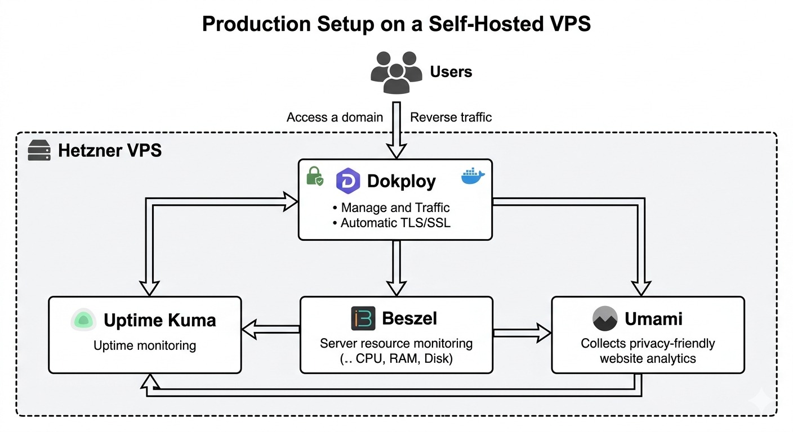
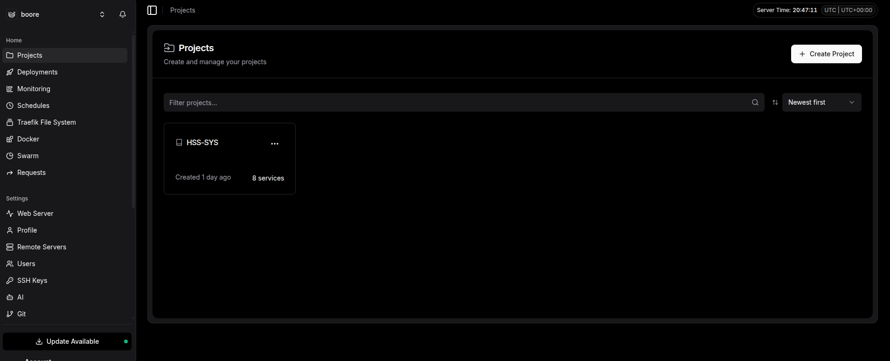
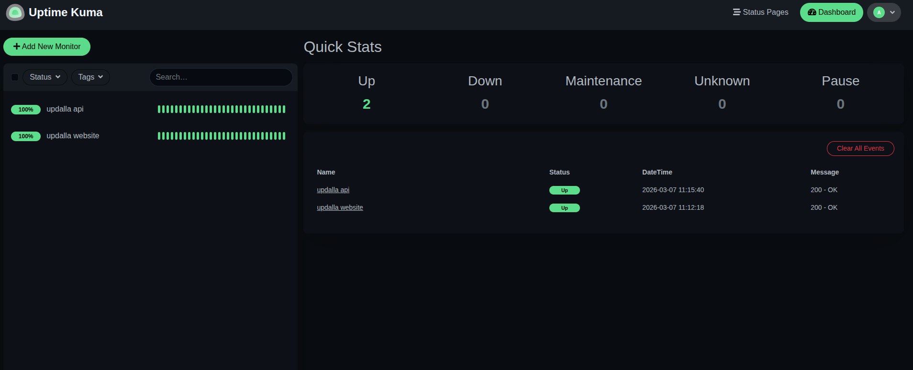
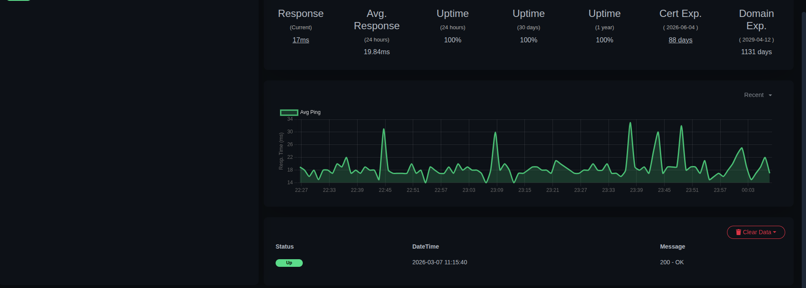
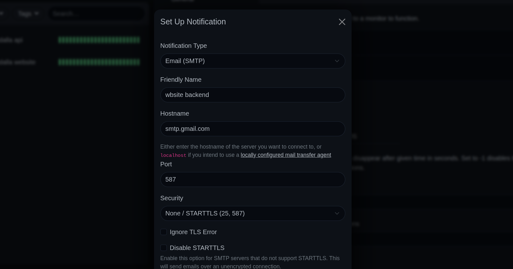
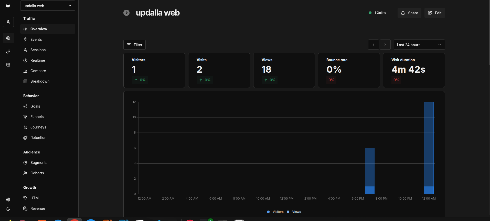
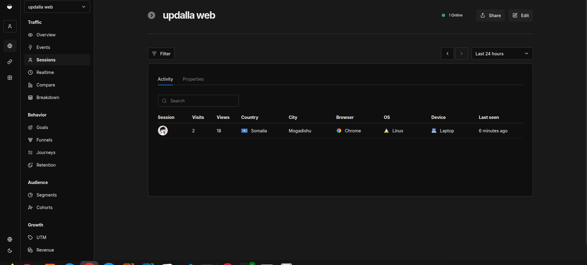
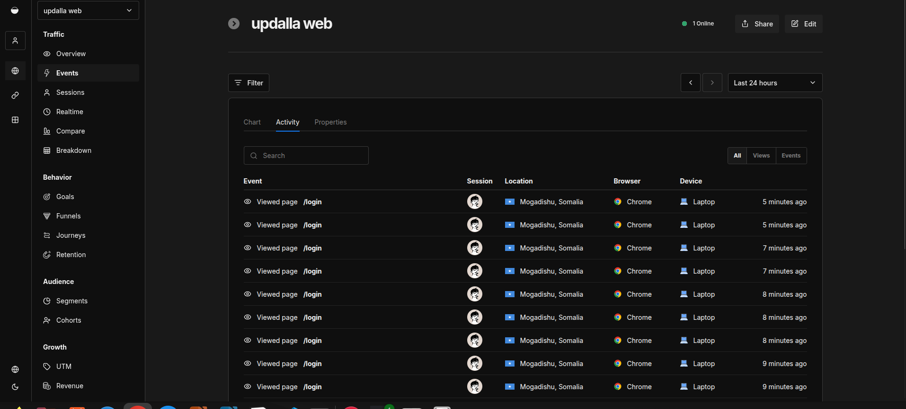

# Production Setup on a Self-Hosted VPS

A comprehensive guide to building and managing a production environment on a Hetzner VPS using Dokploy. This project demonstrates modern DevOps practices including automated deployments, container orchestration, monitoring, and analytics.

## Overview

This repository documents the complete setup of a production-grade self-hosted infrastructure using open-source tools. It's designed for developers who want to learn about DevOps workflows, containerization, and self-hosting their applications.

## Architecture





The system consists of several key components working together:

- **Hetzner VPS**: Cloud infrastructure provider serving as the host
- **Dokploy**: Self-hosted PaaS for application deployment and management
- **Docker**: Container runtime for packaging applications
- **Traefik**: Reverse proxy with automatic TLS certificate management
- **Uptime Kuma**: Self-hosted monitoring and uptime tracking
- **Beszel**: Lightweight server monitoring and metrics
- **Umami**: Privacy-focused web analytics

## Features

- **Automated Deployments**: Push-to-deploy workflows with Dokploy
- **Container Orchestration**: Docker-based application management
- **SSL/TLS Automation**: Automatic certificate generation and renewal via Traefik
- **Server Monitoring**: Real-time server metrics with Beszel
- **Uptime Monitoring**: HTTP/STCP/Ping monitoring with Uptime Kuma
- **Web Analytics**: Privacy-first analytics with Umami
- **Backup Solutions**: Automated backup strategies for data protection

## Tech Stack

| Component           | Technology    |
| ------------------- | ------------- |
| Cloud Provider      | Hetzner       |
| Deployment Platform | Dokploy       |
| Container Runtime   | Docker        |
| Reverse Proxy       | Traefik       |
| Server Monitoring   | Beszel        |
| Uptime Monitoring   | Uptime Kuma   |
| Analytics           | Umami         |
| Operating System    | Ubuntu/Debian |

## Getting Started

### Prerequisites

- A Hetzner Cloud account
- Basic knowledge of Docker and Linux
- SSH access to your VPS

### Quick Start

1. Clone this repository:

   ```bash
   git clone https://github.com/updalla-apshir/self-hosted-vps-devops-stack.git
   cd self-hosted-vps-devops-stack
   ```

2. Follow the [Setup Guide](./docs/setup-guide.md) to provision your VPS

3. Configure Dokploy following the [Deployment Guide](./docs/deployment.md)

4. Set up monitoring as described in [Monitoring Guide](./docs/monitoring.md)

## Documentation

- [Architecture Overview](./docs/architecture.md) - System architecture and component relationships
- [Setup Guide](./docs/setup-guide.md) - Step-by-step VPS configuration
- [Deployment Guide](./docs/deployment.md) - Deploying applications with Dokploy
- [Monitoring Guide](./docs/monitoring.md) - Configuring monitoring tools

## Screenshots

After setting up your environment, capture screenshots and add them to the `images/` folder:

| Tool         | Image File                  | Description                 |
| ------------ | --------------------------- | --------------------------- |
| Architecture | `architecture.png`          | System architecture diagram |
| Dokploy      | `dokploy-dashboard.png`     | Deployment dashboard        |
| Uptime Kuma  | `uptime-kuma-dashboard.png` | Uptime monitoring dashboard |
| Umami        | `umami-dashboard.png`       | Analytics dashboard         |

Example Markdown to add images:

```markdown

```

## Monitoring Setup

This project includes comprehensive monitoring capabilities:

### Uptime Monitoring

Track service availability with Uptime Kuma:




- HTTP/HTTPS endpoint monitoring
- TCP port monitoring
- Ping monitoring
- Custom status pages
- Alert notifications via webhooks

### Server Metrics

Monitor server performance with Beszel:

- CPU usage tracking
- Memory utilization
- Disk I/O monitoring
- Network traffic analysis
- Docker container metrics

### Analytics

Gain insights with Umami:




- Website traffic analysis
- Geographic distribution
- Device and browser stats
- Event tracking
- GDPR-compliant analytics

## Learning Outcomes

By following this setup, you'll learn:

- Server provisioning and hardening
- Docker container management
- Reverse proxy configuration with TLS
- CI/CD pipeline setup
- Monitoring and alerting strategies
- Backup and disaster recovery
- Self-hosted deployment practices

## Project Structure

```
production-vps-setup/
├── README.md                 # Project overview
├── LICENSE                   # MIT License
├── docs/                     # Documentation
│   ├── architecture.md       # System architecture
│   ├── setup-guide.md        # VPS setup instructions
│   ├── deployment.md         # Deployment guide
│   └── monitoring.md         # Monitoring configuration
├── images/                   # Visual resources
├── diagrams/                 # Architecture diagrams
├── scripts/                  # Automation scripts
├── docker/                   # Docker configurations
└── .github/                  # GitHub templates
```

## Contributing

Contributions are welcome! Please read our [contributing guidelines](.github/ISSUE_TEMPLATE.md) before submitting pull requests.

## License

This project is licensed under the MIT License - see the [LICENSE](LICENSE) file for details.

## Acknowledgments

- [Dokploy](https://dokploy.com) - Amazing self-hosted PaaS
- [Traefik](https://traefik.io) - Reverse proxy and load balancer
- [Uptime Kuma](https://uptime.kuma.pet) - Fancy self-hosted monitoring tool
- [Beszel](https://beszel.dev) - Lightweight server monitoring
- [Umami](https://umami.is) - Simple, privacy-focused analytics

---

Built with ❤️ for the self-hosting community
