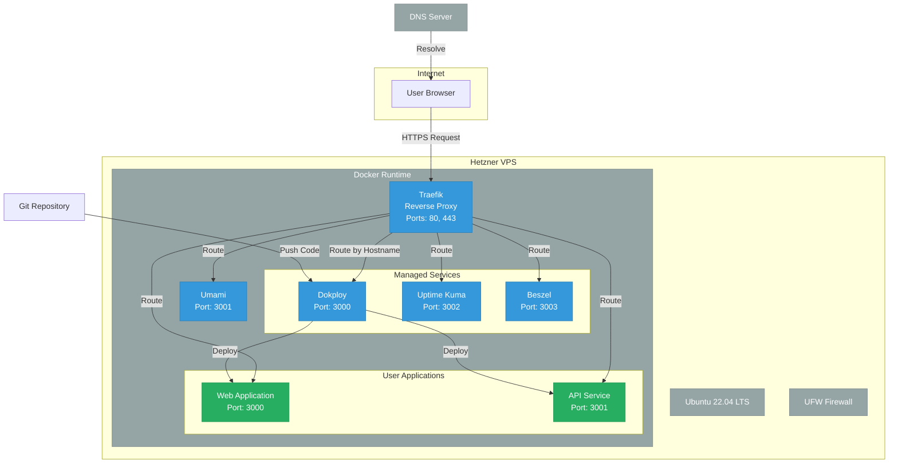
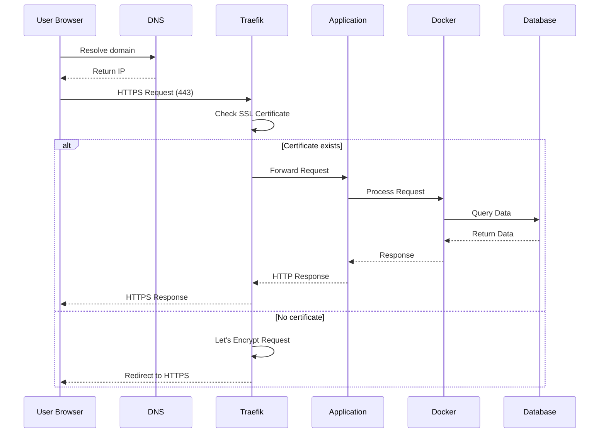
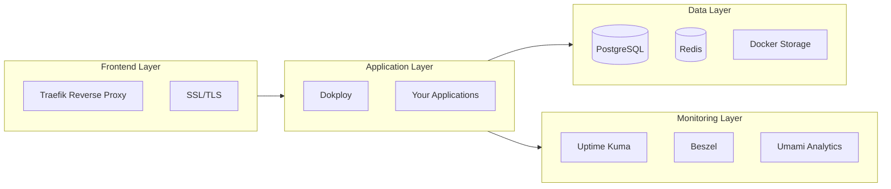
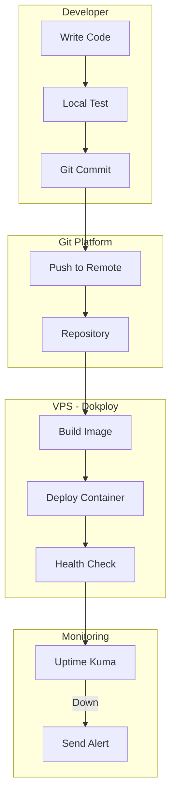
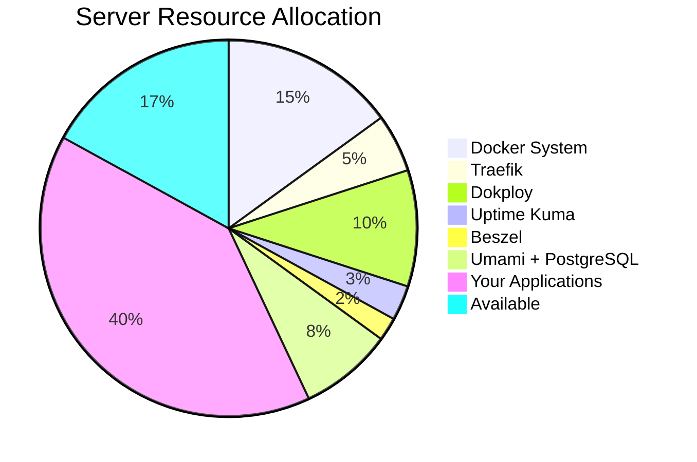
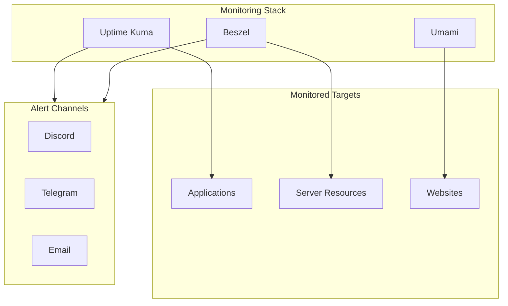

# Architecture Diagram

This folder contains architecture diagrams in Mermaid format and other diagram definitions.

## Mermaid Architecture Diagram

## Network Flow Diagram

## Component Architecture

## Deployment Pipeline

## Server Resource Diagram

## Monitoring Architecture

## Customizing Diagrams

You can render these diagrams using:

1. **VS Code**: Install "Mermaid Preview" extension
2. **Online**: Visit [Mermaid Live Editor](https://mermaid.live)
3. **GitHub**: Add to README.md directly (GitHub renders Mermaid)

## Exporting

To export as PNG:

1. Open [Mermaid Live Editor](https://mermaid.live)
2. Paste diagram code
3. Click "Download PNG"
